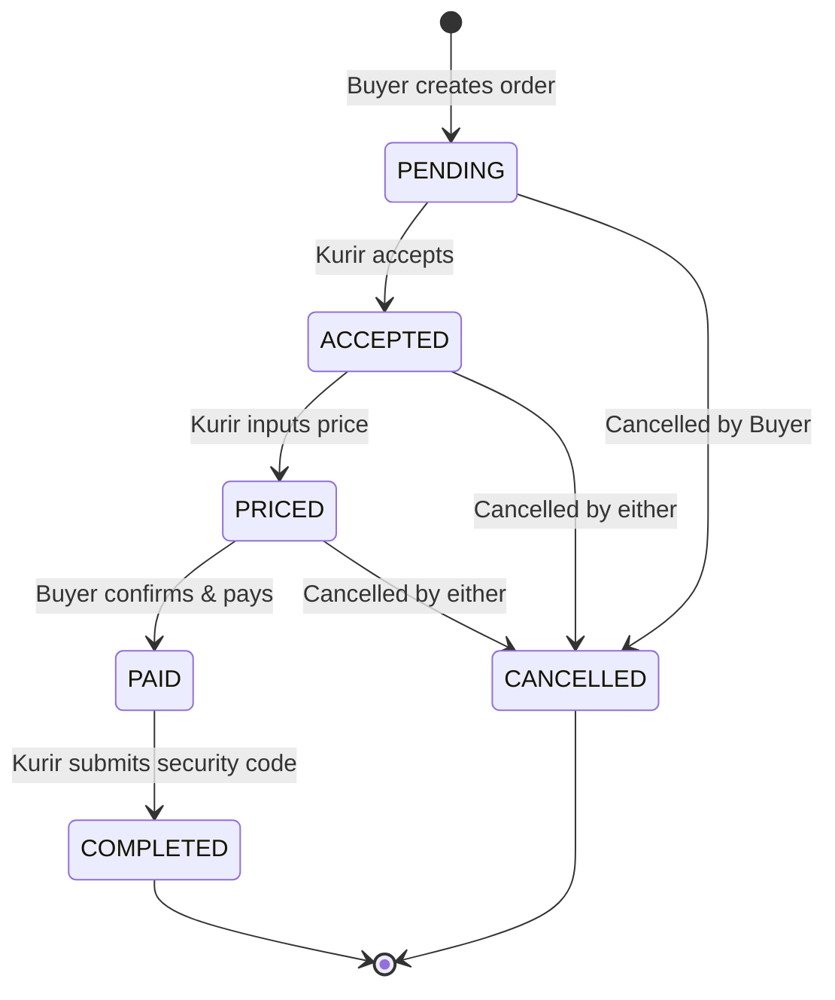

# Order Lifecycle & Statuses

This document outlines the state machine for an Order in BeeTip.

## Status Definitions

* **`PENDING`**: 
  * **Trigger**: The Buyer creates a new order specifying `to_location` and `item_desc`. `item_price` is initially null.
  * **Actions**: The order is visible in the public pool for Kurirs.
* **`ACCEPTED`**: 
  * **Trigger**: A Kurir accepts the order from the pool.
  * **Actions**: `kurir_id` is set. The order is removed from the public pool. A Socket.io chat room (`room_order_<id>`) is established between the Buyer and Kurir.
* **`PRICED`**: 
  * **Trigger**: The Kurir uploads the final `item_price` (and optionally a receipt image).
  * **Actions**: The Buyer is notified to confirm the price and pay.
* **`PAID`**: 
  * **Trigger**: The Buyer accepts the price.
  * **Actions**: 
    * A database transaction reduces the Buyer's balance.
    * A `security_code` (e.g., 4-6 digit OTP) is generated and shown **only** to the Buyer.
    * The Kurir is instructed to proceed with the delivery.
* **`COMPLETED`**: 
  * **Trigger**: The Kurir arrives at the destination, asks the Buyer for the `security_code`, and submits it to the app.
  * **Actions**: 
    * The system verifies the code.
    * If valid, the payment (item price + fixed 5000 delivery fee) is added to the Kurir's balance.
* **`CANCELLED`**: 
  * **Trigger**: Either party cancels before the `PAID` state, or an admin intervenes.
  * **Actions**: The order is terminated. If cancelled after payment but before completion (edge case/dispute), manual refund logic applies.

## State Machine Diagram

