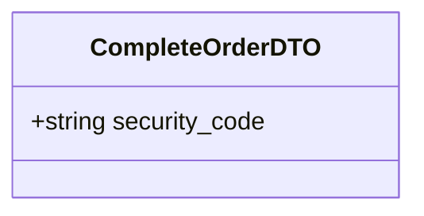

# Complete Order Use Case

The Kurir arrives at the destination, asks the Buyer for the `security_code`, and submits it to complete the order.

If the code matches, the system transfers the funds to the Kurir's balance, and the order transitions to `COMPLETED`.

## Flow

1. Kurir arrives at the `to_location`.
2. Kurir asks the Buyer for the security code.
3. Kurir inputs the code into the app and submits it.
4. Server verifies the code against the order's `security_code`.
5. If valid, server starts an ACID transaction:
   - Increases Kurir's balance by the total amount (`item_price` + `5000` delivery fee).
   - Creates an `EARNING` record in the Transactions table.
   - Updates the order status to `COMPLETED`.
6. Server returns success.

## Endpoints

### POST `/orders/:id/complete`

**REQUIRES AUTHENTICATED USER (MUST BE THE ASSIGNED KURIR)**

#### Request Body

```json
{
    "security_code": "123456"
}
```



#### Response

```json
{
    "message": "Order completed successfully",
    "order": {
        "id": "order-uuid-1",
        "status": "COMPLETED",
        "updatedAt": "2026-05-25T10:30:00Z"
    }
}
```

#### Failure Responses

| Status | Condition |
|--------|-----------|
| `400` | Order is not in `PAID` state, or invalid security code. |
| `401` | Missing or invalid authentication. |
| `403` | User is not the assigned Kurir for this order. |
| `404` | Order not found. |
