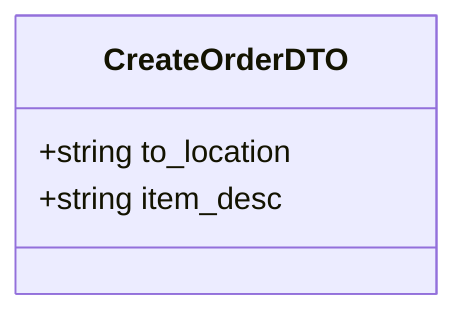
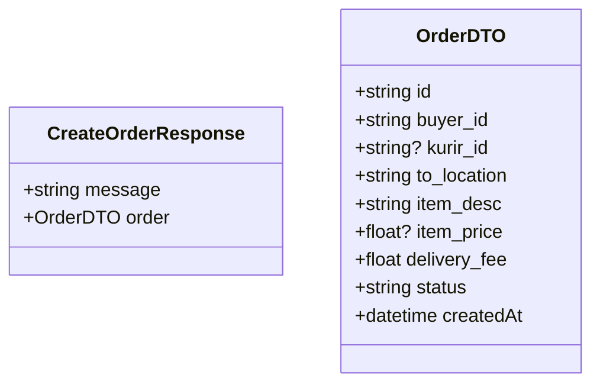

# Create Order Use Case

A User (acting as the Buyer) creates a new proxy buying order.

The order requires the user to specify where they want the item delivered to and a description of what they want. The price starts as `null`.

## Flow

1. User opens the "Create Order" page.
2. User enters `to_location` (e.g., "13th floor room 2") and `item_desc` (e.g., "Chicken rice from canteen").
3. User submits the order.
4. The system validates the input and creates the order in the database with status `PENDING`.
5. The order becomes visible in the public pool for Kurirs to accept.

## Endpoints

### POST `/orders`

**REQUIRES AUTHENTICATED USER**

#### Request Body

```json
{
    "to_location": "13th floor room 2",
    "item_desc": "Chicken rice from canteen"
}
```



#### Response

```json
{
    "message": "Order created successfully",
    "order": {
        "id": "order-uuid",
        "buyer_id": "user-uuid",
        "kurir_id": null,
        "to_location": "13th floor room 2",
        "item_desc": "Chicken rice from canteen",
        "item_price": null,
        "delivery_fee": 5000.0,
        "status": "PENDING",
        "createdAt": "2026-05-25T10:05:00Z"
    }
}
```



#### Failure Responses

| Status | Condition |
|--------|-----------|
| `400` | Missing required fields or validation failure. |
| `401` | Missing or invalid authentication. |
