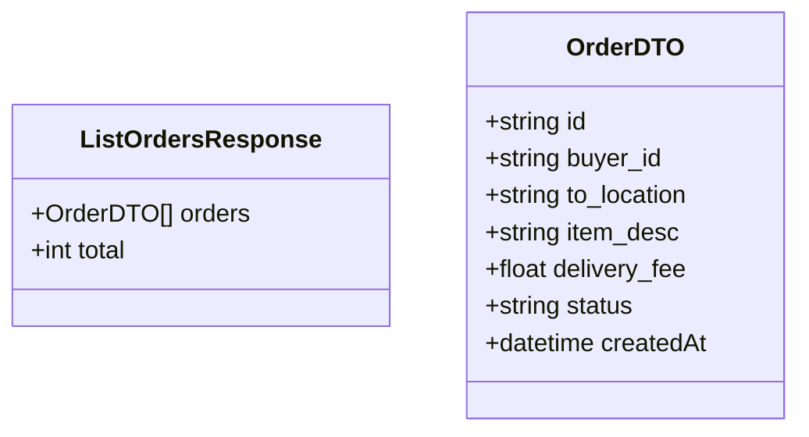

# List Available Orders Use Case

A User (acting as a Kurir) views the public pool of available orders that have not yet been accepted.

This endpoint fetches all orders with the status `PENDING`.

## Flow

1. Kurir opens the "Available Orders" feed.
2. The client fetches the list of pending orders.
3. The server queries the database for orders where `status = 'PENDING'` and returns them.

## Endpoints

### GET `/orders/available`

**REQUIRES AUTHENTICATED USER**

#### Request

No body required. Query parameters can optionally be used for pagination.

#### Response

```json
{
    "orders": [
        {
            "id": "order-uuid-1",
            "buyer_id": "buyer-uuid",
            "to_location": "13th floor room 2",
            "item_desc": "Chicken rice from canteen",
            "delivery_fee": 5000.0,
            "status": "PENDING",
            "createdAt": "2026-05-25T10:05:00Z"
        }
    ],
    "total": 1
}
```



#### Failure Responses

| Status | Condition |
|--------|-----------|
| `401` | Missing or invalid authentication. |
