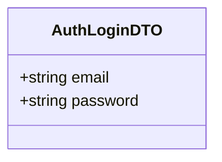
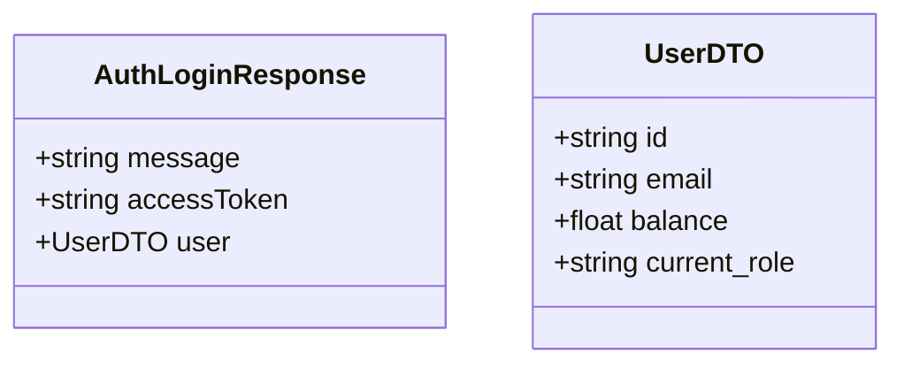

# Login Use Case

A registered user authenticates and receives a JWT access token.

The token contains `{ id, email, role }` in the payload. The token is assigned as a HttpOnly Cookie by the server, and attached to subsequent requests as `Authorization: Bearer <token>`.

## Flow

1. User opens the login screen.
2. User enters email and password.
3. User submits the login form.
4. Server validates credentials against the database.
5. Server signs and returns an access token.
6. Client stores the token and uses it for authenticated requests.

## Endpoints

### POST `/auth/login`

Public endpoint — no authentication required.

#### Request Body

```json
{
    "email": "student@binus.ac.id",
    "password": "securePassword123"
}
```



#### Response

```json
{
    "message": "Login successful",
    "accessToken": "eyJhbGciOiJIUzI1NiIsInR5cCI6IkpXVCJ9...",
    "user": {
        "id": "uuid-1234",
        "email": "student@binus.ac.id",
        "balance": 0.0,
        "current_role": "USER"
    }
}
```



#### Failure Responses

| Status | Condition |
|--------|-----------|
| `400` | Missing required fields (`email`, `password`). |
| `401` | Invalid credentials (wrong email or password). |
