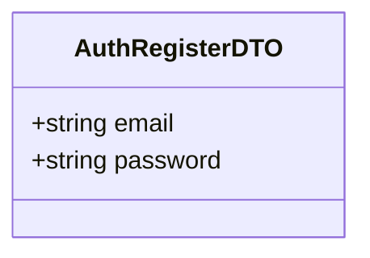
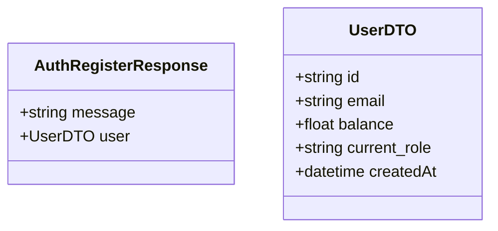

# Register Use Case

A new user creates an account on BeeTip.

The system will create the user with a default balance of `0.0` and a default role (e.g., `USER`, which can be toggled later). The password will be hashed using bcrypt or Argon2 before storing in the PostgreSQL database.

## Flow

1. User opens the registration screen.
2. User enters their email and password.
3. User submits the registration form.
4. Server checks if the email is already in use.
5. If the email is unique, the server hashes the password and saves the user record.
6. The server returns a success response (and optionally a JWT if auto-login is desired, but typically we require a separate login).

## Endpoints

### POST `/auth/register`

Public endpoint — no authentication required.

#### Request Body

```json
{
    "email": "student@binus.ac.id",
    "password": "securePassword123"
}
```



#### Response

```json
{
    "message": "Registration successful",
    "user": {
        "id": "uuid-1234",
        "email": "student@binus.ac.id",
        "balance": 0.0,
        "current_role": "USER",
        "createdAt": "2026-05-25T10:00:00Z"
    }
}
```



#### Failure Responses

| Status | Condition |
|--------|-----------|
| `400` | Missing required fields (`email`, `password`) or invalid email format. |
| `409` | Email already exists (Conflict). |
