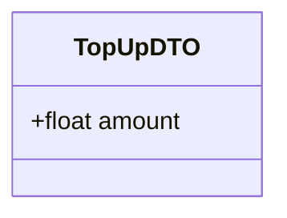

# Top Up Balance Use Case

Since actual payment gateways are not yet integrated, this mock endpoint allows any authenticated user to manually add funds to their balance.

## Flow

1. User goes to their wallet/profile screen.
2. User selects an amount to deposit.
3. User submits the request.
4. Server increases the user's balance by the requested amount.
5. Server creates a `DEPOSIT` record in the Transactions table.

## Endpoints

### POST `/transactions/deposit`

**REQUIRES AUTHENTICATED USER**

#### Request Body

```json
{
    "amount": 100000.0
}
```



#### Response

```json
{
    "message": "Deposit successful",
    "transaction": {
        "id": "tx-uuid-1",
        "type": "DEPOSIT",
        "amount": 100000.0,
        "status": "SUCCESS",
        "createdAt": "2026-05-25T09:00:00Z"
    },
    "new_balance": 100000.0
}
```

#### Failure Responses

| Status | Condition |
|--------|-----------|
| `400` | Invalid amount (e.g., negative value). |
| `401` | Missing or invalid authentication. |
