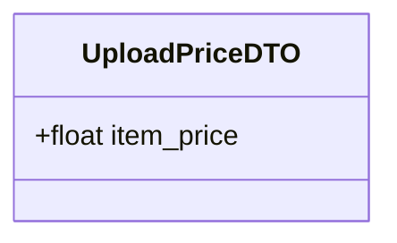

# Upload Price Use Case

The Kurir has found the requested item and uploads the final `item_price` to the order.

This transitions the order status to `PRICED`, notifying the Buyer to review and pay.

## Flow

1. Kurir locates the item and determines the price.
2. Kurir inputs the price (and optionally uploads a receipt via an attachment service).
3. Kurir submits the price.
4. Server verifies the order is in `ACCEPTED` status and belongs to the requesting Kurir.
5. Server updates the `item_price` and sets status to `PRICED`.

## Endpoints

### POST `/orders/:id/price`

**REQUIRES AUTHENTICATED USER (MUST BE THE ASSIGNED KURIR)**

#### Request Body

```json
{
    "item_price": 25000.0
}
```



#### Response

```json
{
    "message": "Price updated successfully",
    "order": {
        "id": "order-uuid-1",
        "item_price": 25000.0,
        "delivery_fee": 5000.0,
        "status": "PRICED",
        "updatedAt": "2026-05-25T10:15:00Z"
    }
}
```

#### Failure Responses

| Status | Condition |
|--------|-----------|
| `400` | Order is not in `ACCEPTED` state, or invalid price value. |
| `401` | Missing or invalid authentication. |
| `403` | User is not the assigned Kurir for this order. |
| `404` | Order not found. |
